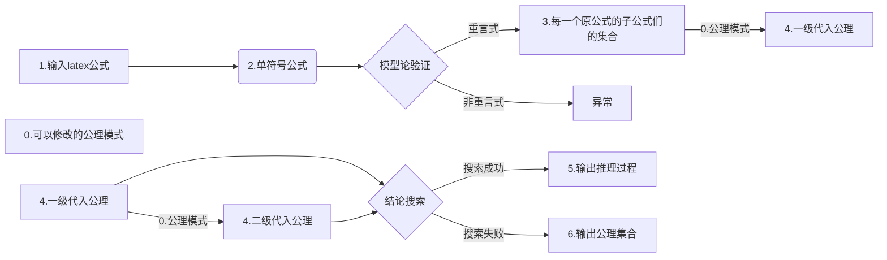

## 数理逻辑导论课程——经典命题演算——证明论——计算机辅助证明探索。
###### 叶璨铭

### 前言

由于我比较菜，所以作业不会做（至今一题都没探索成功），代入一堆公式觉得很烦。看了书上的例题无法领会到精髓，但是自动证明机我肯定不会，只能勉强根据自动真值模型机扩展一下，辅助一下的样子。大概想法是把所有能写的公理都写出来，让计算机写，或许能帮助一下。

处理字符串，没学过，很多数据结构和算法都不会。所以我只会处理只有一个字符的变量、一个字符的运算符，用不了latex公式之类的，但是latex好处是直接打英文，打字快，所以我第一步就是翻译。由于正则表达式不会，所以翻译也翻译的不太好，限制很多。然后处理表达式，我也不会，只能勉强用一下递归、搜索这样子。

所以要多学一学、练习一下。

没有推理，只有代入，以后再加。有点难。

### 项目结构

### 具体功能模块的解释
1.恒真验证
使用模型论手段验证是重言式。如果不是，指出一个真值指派
2.子公式分析
输出到 子公式工序里面
3.翻译
输入英文的意思，匹配翻译成单符号语言
4.一级带入。（第一广度）
子公式作为数据库，
打印出三个公理模式的，2个或三个字母的，每个字母是子公式数据库中的每一个子公式的 所有公理
这是笛卡尔积。
输入到 一级公理。

